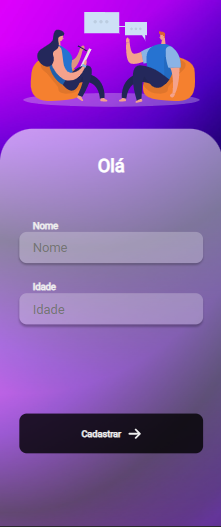
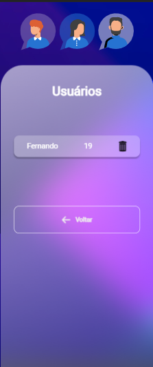

# Tela-Login React
 

 

> Resultado do projeto!
###  Tecnologias utilizadas no Projeto:

- [x] JavaScript              
<<<<<<< HEAD
- [x] React                    
- [x] Styled-Components       
- [x] Yarn
=======
- [x] React                  
- [x] Styled-Components       
- [x] Yarn
- [x] Axios 
>>>>>>> 36812cbb3bbd20738cce18bd0490d999c1076e0b
- [x] Hooks 
- [x] Router-dom

##  Desenvolvido por:

<tabela>
  <tr>
    <td align="center">
      <a href="#">
         
        
          <b>Fernando Freitas</b>
        
      </a>
    </td>
   </tr>
</table>
